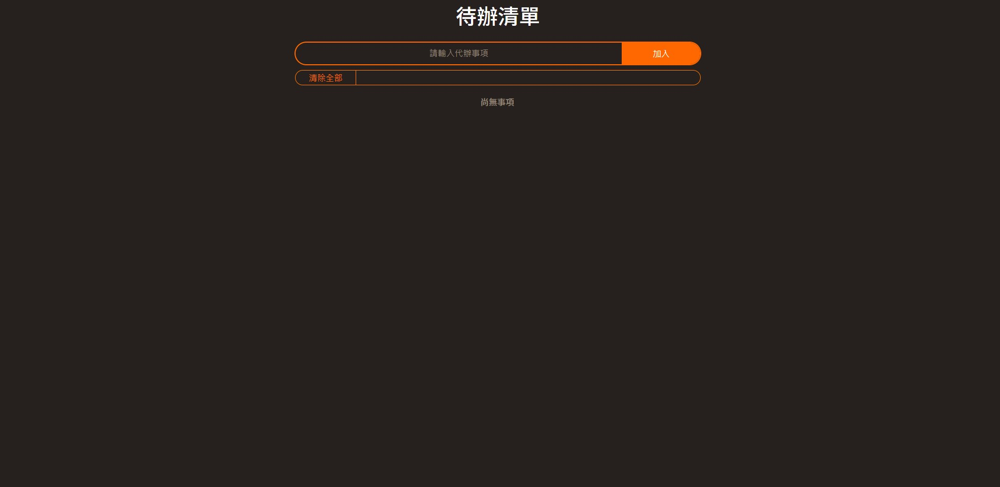
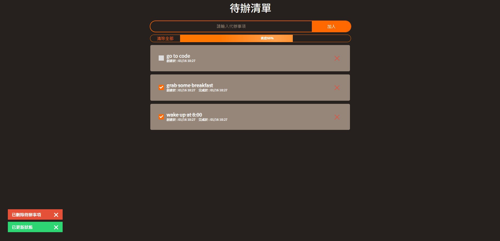

## Todo List
Show on https://chippo0122.github.io/to_do_list_vue/

功能如下：
* 新增任務
* 查看任務列表
* 更新任務完成狀態
* 刪除任務
* 清除全部任務功能
* 進度條提醒功能
* 操作通知提醒功能

## 使用說明

由上方輸入格鍵入所欲完成之任務清單，並按下加入紐，既可完成新增任務

若鍵入為空值，則無法新增任務並跳出提醒

新增完成後，可見視圖如下：

各任務項目條可顯示任務內容、創建時間及完成時間，

任務項目條左側核取方塊可點擊更新該任務完成狀態，

若任務處於完成狀態，核取方塊為亮橘色且項目條帶有完成時間，

點擊項目條右側紅色刪除紐，可刪除該條任務，

任務條上方之進度條可顯示目前所有任務及已完成任務之百分比，使視覺上較有感受

進度條左側設有清除全部任務功能鍵，可視情況使用

以上操作皆於視圖左下設有提醒功能。

使用技術如下：
* Vue.js 3(Options API)
* Vuex
* SCSS預處理器
